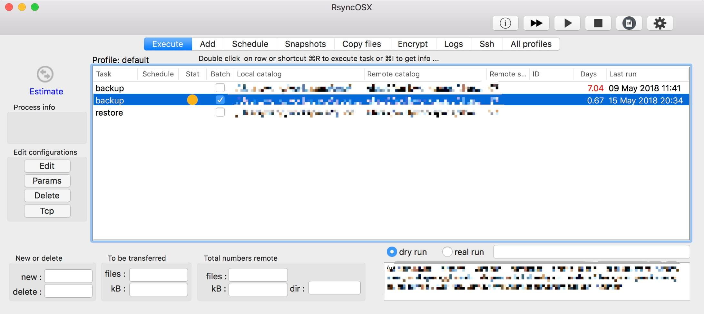

# 深度框架 MXNet / Gluon 初体验


> MXNet: A flexible and efficient library for deep learning.

这是MXNet的[官网](https://mxnet.incubator.apache.org/)介绍，“MXNet是灵活且高效的深度学习库”。

MXNet是主流的三大深度学习框架之一：

- [TensorFlow](https://www.tensorflow.org/)：Google支持，其简化版是[Keras](https://keras.io/)；
- [PyTorch](https://pytorch.org/)：Facebook支持，其工业版是[Caffe2](https://caffe2.ai/)；
- MXNet：中立，Apache孵化器项目，也被AWS选为官方DL平台；

MXNet的优势是，其开发者之一李沐，是中国人🇨🇳，在MXNet的推广中具有语言优势（汉语），有利于国内开发者的学习。同时，推荐李沐录制的[教学视频](https://discuss.gluon.ai/t/topic/753)，非常不错。

MXNet的高层接口是Gluon，Gluon同时支持灵活的动态图和高效的静态图，既保留动态图的易用性，也具有静态图的高性能，这也是官网介绍的*flexible*和*efficient*的出处。同时，MXNet还具备大量学术界的前沿算法，方便移植至工业界。希望MXNet团队再接再励，在深度学习框架的竞赛中，位于前列。

因此，掌握 **MXNet/Gluon** 很有必要。

本文以深度学习的**多层感知机**（Multilayer Perceptrons）为算法基础，数据集选用[MNIST](http://yann.lecun.com/exdb/mnist/)，介绍MXNet的工程细节。

本文的[源码](https://github.com/SpikeKing/gluon-tutorial)：https://github.com/SpikeKing/gluon-tutorial

---

## 数据集

在虚拟环境（Virtual Env）中，直接使用pip安装MXNet即可：

``` text
pip install mxnet
```

如果下载速度较慢，推荐使用**阿里云**的pypi源：

``` text
-i http://mirrors.aliyun.com/pypi/simple --trusted-host mirrors.aliyun.com
```

[MNIST](http://yann.lecun.com/exdb/mnist/)就是著名的手写数字识别库，其中包含0至9等10个数字的手写体，图片大小为28*28的灰度图，目标是根据图片识别正确的数字。

MNIST库在MXNet中被封装为**MNIST类**，数据存储于``.mxnet/datasets/mnist``中。如果下载MNIST数据较慢，可以选择到[MNIST](http://yann.lecun.com/exdb/mnist/)官网下载，放入mnist文件夹中即可。在MNIST类中：

- 参数``train``：是否为训练数据，其中true是训练数据，false是测试数据；
- 参数``transform``：数据的转换函数，lambda表达式，转换数据和标签为指定的数据类型；

源码：

``` python
# 参数train
if self._train:
    data, label = self._train_data, self._train_label
else:
    data, label = self._test_data, self._test_label
    
# 参数transform
if self._transform is not None:
    return self._transform(self._data[idx], self._label[idx])
return self._data[idx], self._label[idx]
```

在MXNet中，数据加载类被封装成**DataLoader类**，迭代器模式，迭代输出与批次数相同的样本集。在DataLoader中，

- 参数``dataset``：数据源，如MNIST；
- 参数``batch_size``：训练中的批次数量，在迭代中输出指定数量的样本；
- 参数``shuffle``：是否洗牌，即打乱数据，一般在训练时需要此操作。

迭代器的测试，每次输出样本个数（第1维）与指定的批次数量相同：

``` python
for data, label in train_data:
    print(data.shape)  # (64L, 28L, 28L, 1L)
    print(label.shape)  # (64L,)
    break
```

在``load_data()``方法中，输出训练和测试数据，数据类型是0~1（灰度值除以255）的浮点数，标签类型也是浮点数。

具体实现：

``` python
def load_data(self):
    def transform(data, label):
        return data.astype(np.float32) / 255., label.astype(np.float32)
    train_data = DataLoader(MNIST(train=True, transform=transform),
                            self.batch_size, shuffle=True)
    test_data = DataLoader(MNIST(train=False, transform=transform),
                           self.batch_size, shuffle=False)
    return train_data, test_data
```

---

## 模型

网络模型使用MXNet中Gluon的样式：

1. 创建``Sequential()``序列，Sequential是全部操作单元的容器；
2. 添加全连接单元Dense，参数units是输出单元的个数，参数activation是激活函数；
3. 初始化参数：
    - init是数据来源，Normal类即正态分布，sigma是正态分布的标准差；
    - ctx是上下文，表示训练中参数更新使用CPU或GPU，如mx.cpu()；

Gluon的Sequential类与其他的深度学习框架类似，通过**有序地**连接不同的操作单元，组成不同的网络结构，每一层只需设置输出的维度，输入维度通过上一层传递，转换矩阵在内部自动计算。

实现：

``` python
def model(self):
    num_hidden = 64
    net = gluon.nn.Sequential()
    with net.name_scope():
        net.add(gluon.nn.Dense(units=num_hidden, activation="relu"))
        net.add(gluon.nn.Dense(units=num_hidden, activation="relu"))
        net.add(gluon.nn.Dense(units=self.num_outputs))

    net.collect_params().initialize(init=mx.init.Normal(sigma=.1), ctx=self.model_ctx)
    print(net)  # 展示模型
    return net
```

其中，``net.name_scope()``为Sequential中的操作单元自动添加名称。

### [模型可视化](https://mxnet.incubator.apache.org/faq/visualize_graph.html)

直接使用print()，打印模型结构，如``print(net)``：

``` text
Sequential(
  (0): Dense(None -> 64, Activation(relu))
  (1): Dense(None -> 64, Activation(relu))
  (2): Dense(None -> 10, linear)
)
```

或，使用稍复杂的**jupyter**绘制模型，安装jupyter包（Python 2.x）：

``` text
pip install ipython==5.3.0
pip install jupyter==1.0.0
```

启动jupyter服务，访问``http://localhost:8888/``：

``` text
jupyter notebook
```

新建``Python 2``文件，编写绘制网络的代码。代码的样式是，在已有模型之后，添加“绘制逻辑”，调用``plot_network()``即可绘图。如果替换Sequential类为HybridSequential类，可以提升绘制效率，不替换也不会影响绘制效果

网络模型和绘制逻辑：

``` python
import mxnet as mx
from mxnet import gluon

num_hidden = 64
net = gluon.nn.HybridSequential()
with net.name_scope():
    net.add(gluon.nn.Dense(num_hidden, activation="relu"))
    net.add(gluon.nn.Dense(num_hidden, activation="relu"))
    net.add(gluon.nn.Dense(10))

# 绘制逻辑
net.hybridize()
net.collect_params().initialize()
x = mx.sym.var('data')
sym = net(x)
mx.viz.plot_network(sym)
```

效果图：


---

## 训练

在训练前，加载数据，创建网络。

``` python
train_data, test_data = self.load_data()  # 训练和测试数据
net = self.model()  # 模型
```

接着，创建交叉熵的接口``softmax_cross_entropy``，创建训练器``trainer``。

训练器的参数包含：网络中参数、优化器、优化器的参数等。

``` python
epochs = 10
smoothing_constant = .01
num_examples = 60000

softmax_cross_entropy = gluon.loss.SoftmaxCrossEntropyLoss()  # 交叉熵
trainer = gluon.Trainer(params=net.collect_params(),
                        optimizer='sgd',
                        optimizer_params={'learning_rate': smoothing_constant})
```

循环epoch训练网络模型：

1. 从迭代器``train_data``源中，获取批次数据和标签：
2. 指定数据和标签的执行环境ctx是CPU或GPU，同时展开数据为1行；
3. 自动梯度计算``autograd.record()``，网络预测数据，输出output，计算交叉熵loss；
4. 对于loss反向传播求导，设置训练器trainer的步骤为批次数；
4. 在``cumulative_loss``中，累加每个批次的损失loss，计算全部损失；
5. 在训练一次epoch之后，计算测试和训练数据的准确率accuracy；

不断循环，直至执行完成全部epochs为止。

训练的实现：

``` python
for e in range(epochs):
    cumulative_loss = 0  # 累积的
    for i, (data, label) in enumerate(train_data):
        data = data.as_in_context(self.model_ctx).reshape((-1, 784))  # 数据
        label = label.as_in_context(self.model_ctx)  # 标签

        with autograd.record():  # 梯度
            output = net(data)  # 输出
            loss = softmax_cross_entropy(output, label)  # 输入和输出计算loss

        loss.backward()  # 反向传播
        trainer.step(data.shape[0])  # 设置trainer的step
        cumulative_loss += nd.sum(loss).asscalar()  # 计算全部损失

    test_accuracy = self.__evaluate_accuracy(test_data, net)
    train_accuracy = self.__evaluate_accuracy(train_data, net)
    print("Epoch %s. Loss: %s, Train_acc %s, Test_acc %s" %
          (e, cumulative_loss / num_examples, train_accuracy, test_accuracy))
```

在预测接口``evaluate_accuracy()``中：

1. 创建准确率Accuracy类acc，用于统计准确率；
2. 迭代输出批次的数据和标签；
3. 预测数据不同类别的概率，选择最大概率（argmax）做为类别；
4. 通过``acc.update()``更新准确率；

最终返回准确率的值，即acc的第2维``acc[1]``，而acc的第1维``acc[0]``是acc的名称。

``` python
def __evaluate_accuracy(self, data_itertor, net):
    acc = mx.metric.Accuracy()  # 准确率
    for i, (data, label) in enumerate(data_iterator):
        data = data.as_in_context(self.model_ctx).reshape((-1, 784))
        label = label.as_in_context(self.model_ctx)
        output = net(data)  # 预测结果
        predictions = nd.argmax(output, axis=1)  # 类别
        acc.update(preds=predictions, labels=label)  # 更新概率和标签
    return acc.get()[1]  # 第1维是数据名称，第2维是概率
```

效果：

``` python
Epoch 0. Loss: 1.2743850797812144, Train_acc 0.846283333333, Test_acc 0.8509
Epoch 1. Loss: 0.46071574948628746, Train_acc 0.884366666667, Test_acc 0.8892
Epoch 2. Loss: 0.37149955205917357, Train_acc 0.896466666667, Test_acc 0.9008
Epoch 3. Loss: 0.3313815038919449, Train_acc 0.908366666667, Test_acc 0.9099
Epoch 4. Loss: 0.30456133014361064, Train_acc 0.915966666667, Test_acc 0.9172
Epoch 5. Loss: 0.2827877395868301, Train_acc 0.919466666667, Test_acc 0.9214
Epoch 6. Loss: 0.2653073514064153, Train_acc 0.925433333333, Test_acc 0.9289
Epoch 7. Loss: 0.25018166739145914, Train_acc 0.92965, Test_acc 0.9313
Epoch 8. Loss: 0.23669789231618246, Train_acc 0.933816666667, Test_acc 0.9358
Epoch 9. Loss: 0.22473177655935286, Train_acc 0.934716666667, Test_acc 0.9337
```

## GPU

对于深度学习而言，使用GPU可以加速网络的训练过程，MXNet同样支持使用GPU训练网络。

检查服务器的Cuda版本，命令：``nvcc --version``，用于确定下载MXNet的GPU版本。

``` text
nvcc: NVIDIA (R) Cuda compiler driver
Copyright (c) 2005-2016 NVIDIA Corporation
Built on Sun_Sep__4_22:14:01_CDT_2016
Cuda compilation tools, release 8.0, V8.0.44
```

则，当前服务器的Cuda版本是8.0。

将MXNet由CPU版本转为[GPU版本](https://mxnet.incubator.apache.org/install/index.html)，卸载``mxnet``，安装``mxnet-cu80``。

``` text
pip uninstall mxnet
pip install mxnet-cu80
```

当安装完成GPU版本之后，在Python Console中，执行如下代码，确认MXNet的GPU库可以使用。

``` python
>>> import mxnet as mx
>>> a = mx.nd.ones((2, 3), mx.gpu())
>>> b = a * 2 + 1
>>> b.asnumpy()
array([[ 3.,  3.,  3.],
       [ 3.,  3.,  3.]], dtype=float32)
```

检查GPU数量，命令：``nvidia-smi``：

``` text
+-----------------------------------------------------------------------------+
| NVIDIA-SMI 375.26                 Driver Version: 375.26                    |
|-------------------------------+----------------------+----------------------+
| GPU  Name        Persistence-M| Bus-Id        Disp.A | Volatile Uncorr. ECC |
| Fan  Temp  Perf  Pwr:Usage/Cap|         Memory-Usage | GPU-Util  Compute M. |
|===============================+======================+======================|
|   0  TITAN X (Pascal)    Off  | 0000:02:00.0     Off |                  N/A |
| 28%   49C    P2    84W / 250W |  12126MiB / 12189MiB |     25%      Default |
+-------------------------------+----------------------+----------------------+
|   1  TITAN X (Pascal)    Off  | 0000:03:00.0     Off |                  N/A |
| 24%   39C    P2    57W / 250W |  12126MiB / 12189MiB |     33%      Default |
+-------------------------------+----------------------+----------------------+
|   2  TITAN X (Pascal)    Off  | 0000:83:00.0     Off |                  N/A |
| 25%   41C    P2    58W / 250W |  12126MiB / 12189MiB |     37%      Default |
+-------------------------------+----------------------+----------------------+
|   3  TITAN X (Pascal)    Off  | 0000:84:00.0     Off |                  N/A |
| 23%   31C    P2    53W / 250W |  11952MiB / 12189MiB |      2%      Default |
+-------------------------------+----------------------+----------------------+
```

则，当前服务器的GPU数量是4。

设置参数环境ctx为GPU的列表，即``[mx.gpu(0), mx.gpu(1), ...]``。

``` python
GPU_COUNT = 4
ctx = [mx.gpu(i) for i in range(GPU_COUNT)]
```

在网络net中使用GPU初始化initialize()参数params，然后创建trainer训练器。

``` python
net = self.model()  # 模型
net.collect_params().initialize(init=mx.init.Normal(sigma=.1), ctx=ctx)

smoothing_constant = .01
trainer = gluon.Trainer(params=net.collect_params(),
                        optimizer='sgd',
                        optimizer_params={'learning_rate': smoothing_constant})
```

循环执行10个epoch训练模型，``train_data``和``valid_data``是迭代器，每次输出一个batch样本集。在``train_batch()``中，依次传入批次数据batch、GPU环境列表ctx、网络net和训练器trainer；在``valid_batch()``中，与训练类似，只是不传训练器trainer。

``` python
epochs = 10
for e in range(epochs):
    start = time()
    for batch in train_data:
        self.train_batch(batch, ctx, net, trainer)
    nd.waitall()  # 等待所有异步的任务都终止
    print('Epoch %d, training time = %.1f sec' % (e, time() - start))
    correct, num = 0.0, 0.0
    for batch in valid_data:
        correct += self.valid_batch(batch, ctx, net)
        num += batch[0].shape[0]
    print('\tvalidation accuracy = %.4f' % (correct / num))
```

具体分析批次训练方法``train_batch()``：

1. 输入batch是数据和标签的集合，索引0表示数据，索引1表示标签。
2. 根据GPU的数量，拆分数据data与标签label，每个GPU对应不同的数据；
3. 每组数据和标签，分别反向传播backward()更新网络net的参数；
4. 设置训练器trainer的步骤step为批次数``batch_size``；

多个GPU是相互独立的，因此，当使用多个GPU训练模型时，需要注意不同GPU之间的数据融合。

实现如下：

``` python
@staticmethod
def train_batch(batch, ctx, net, trainer):
    # split the data batch and load them on GPUs
    data = gluon.utils.split_and_load(batch[0], ctx)  # 列表
    label = gluon.utils.split_and_load(batch[1], ctx)  # 列表
    # compute gradient
    GluonFirst.forward_backward(net, data, label)
    # update parameters
    trainer.step(batch[0].shape[0])
    
@staticmethod
def forward_backward(net, data, label):
    loss = gluon.loss.SoftmaxCrossEntropyLoss()
    with autograd.record():
        losses = [loss(net(X), Y) for X, Y in zip(data, label)]  # loss列表
    for l in losses:  # 每个loss反向传播
        l.backward()
```

具体分析批次验证方法``valid_batch()``：

1. 将全部验证数据，都运行于一个GPU中，即ctx[0]；
2. 网络net预测数据data的类别概率，再转换为具体类别argmax()；
3. 将全部预测正确的样本进行汇总，获得总的正确样本数；

实现如下：

``` python
@staticmethod
def valid_batch(batch, ctx, net):
    data = batch[0].as_in_context(ctx[0])
    pred = nd.argmax(net(data), axis=1)
    return nd.sum(pred == batch[1].as_in_context(ctx[0])).asscalar()
```

除了训练部分，GPU的数据加载和网络模型都与CPU一致。

训练GPU模型，需要连接远程服务器，上传工程。如果无法使用Git传输，则推荐使用[RsyncOSX](https://github.com/rsyncOSX/RsyncOSX)，非常便捷的文件同步工具：



在远程服务器中，将工程的依赖库安装至虚拟环境中，注意需要使用MXNet的GPU版本``mxnet-cu80``，接着，执行模型训练。

以下是GPU版本的模型输出结果：

``` text
Epoch 5, training time = 13.7 sec
	validation accuracy = 0.9277
Epoch 6, training time = 13.9 sec
	validation accuracy = 0.9284
Epoch 7, training time = 13.8 sec
	validation accuracy = 0.9335
Epoch 8, training time = 13.7 sec
	validation accuracy = 0.9379
Epoch 9, training time = 14.4 sec
	validation accuracy = 0.9402
```

当遇到如下警告⚠️时：

``` text
only 4 out of 12 GPU pairs are enabled direct access. 
It may affect the performance. You can set MXNET_ENABLE_GPU_P2P=0 to turn it off
```

关闭``MXNET_ENABLE_GPU_P2P``即可，不影响正常的训练过程。

``` text
export MXNET_ENABLE_GPU_P2P=0
```

---

至此 **MXNet/Gluon** 的工程设计，已经全部完成，从数据集、模型、训练、GPU四个部分剖析MXNet的实现细节，MXNet的各个环节设计的非常巧妙，也与其他框架类似，容易上手。实例虽小，“五脏俱全”，为继续学习MXNet框架，起到抛砖引玉的作用。

OK, that's all! Enjoy it!


